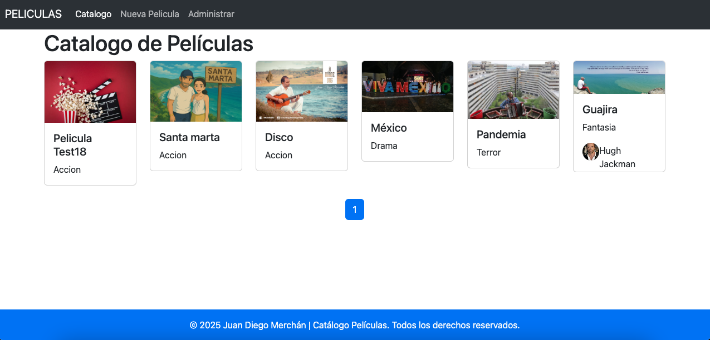
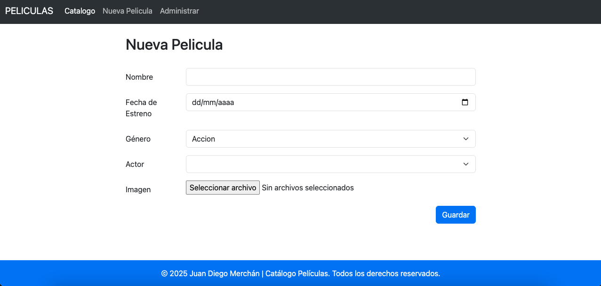

#  Catálogo de Películas

Aplicación web para gestionar un catálogo de películas, desarrollada con **Spring Boot** y **Thymeleaf**.

## ✨ Funcionalidades

* 📝 **CRUD completo** de películas (Crear, Leer, Actualizar, Eliminar).
* 🎭 **Visualización** de detalles de películas.
* 🎨 **Interfaz intuitiva** con Bootstrap 5.

## 🛠️ Tecnologías

* **Backend**: Java 21, Spring Boot 3, Spring Data JPA
* **Frontend**: Thymeleaf, Bootstrap 5, JavaScript
* **Base de datos**: MySQL
* **Herramientas**: Maven, Git

## 🚀 Cómo ejecutarlo

### Requisitos

* Java 21
* MySQL 8+
* Maven

### Pasos

1. Clona el repositorio:

   ```bash
   git clone https://github.com/Juandmj82/Portafolio.git
   cd Portafolio/CRUDPeliculas
   ```

2. Crea una base de datos en MySQL:

   ```sql
   CREATE DATABASE catalogo_peliculas;
   ```

3. Configura las credenciales en el archivo `application.properties`:

   ```properties
   # src/main/resources/application.properties
   spring.datasource.username=tu_usuario
   spring.datasource.password=tu_contraseña
   ```

4. Ejecuta la aplicación:

   ```bash
   mvn spring-boot:run
   ```

### Acceso

* URL: (http://localhost:8080)

## 🎥 Vistas principales

### 📄 Vista general del catálogo



### ➕ Agregar película



### ⚙️ Administrar películas


## 🏗️ Estructura del proyecto

```bash
src/
├── main/
│   ├── java/com/juandidev/crudpeliculas/
│   │   ├── config/             # Configuraciones de Spring
│   │   ├── controller/         # Controladores MVC
│   │   ├── dao/                # Interfaces de repositorios
│   │   ├── entity/             # Entidades JPA
│   │   └── service/            # Servicios e implementaciones
│   │       └── impl/
│   └── resources/
│       ├── static/             # Recursos estáticos (CSS, JS, imágenes)
│       └── templates/          # Plantillas Thymeleaf
│           ├── layouts/        # Fragmentos base
│           ├── home.html       # Página principal
│           ├── listado.html    # Lista de películas
│           └── pelicula.html   # Formulario de película
```

## 🌱 Próximas mejoras

* [ ] Sistema de autenticación de usuarios
* [ ] Valoraciones y comentarios
* [ ] Filtros avanzados por género y año
* [ ] Pruebas unitarias

## 📄 Licencia

Este proyecto está licenciado bajo la **MIT License**.

## ✂️ Autor

Desarrollado por [Juan Diego Merchán](https://github.com/Juandmj82) - 2025 🚀
