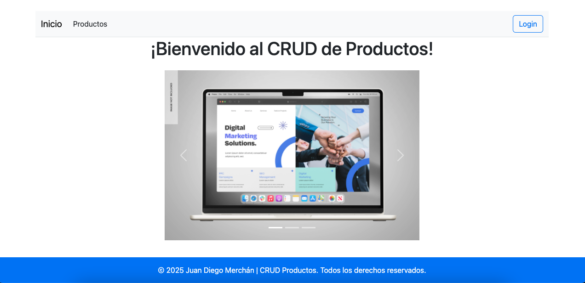
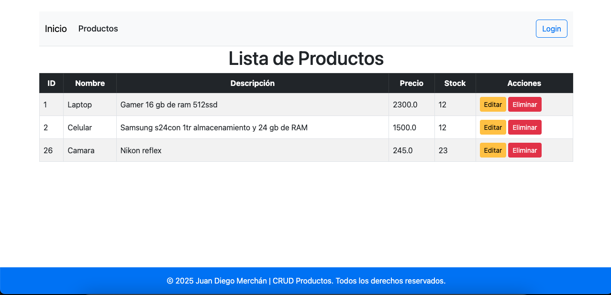
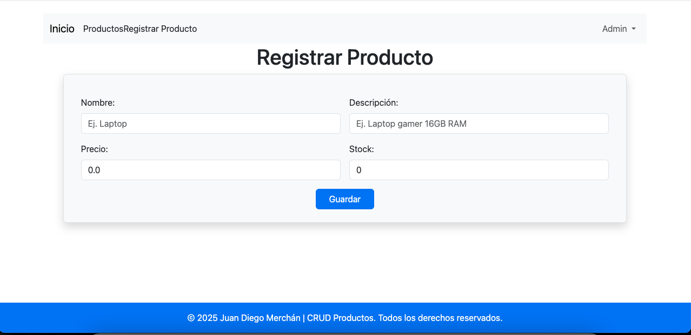

# 🛍️ CRUD de Productos con Spring Boot

Aplicación web básica para gestionar productos, desarrollada como práctica de aprendizaje con Spring Boot y Thymeleaf.

## ✨ Funcionalidades
- 📝 **CRUD completo** de productos (Crear, Leer, Actualizar, Eliminar).
- 🔐 **Autenticación** con roles (Administrador y Usuario).
- ✅ Validaciones en **frontend y backend**.
- 🎨 Interfaz con **Bootstrap 5** + **SweetAlert2**.

## 🛠️ Tecnologías
- **Backend**: Java 21, Spring Boot 3, Spring Security, Spring Data JPA.
- **Frontend**: Thymeleaf, Bootstrap 5, JavaScript.
- **Base de datos**: MySQL.
- **Herramientas**: Maven, Git.

## 🚀 Cómo ejecutarlo

### Requisitos
- Java 21
- MySQL 8+
- Maven

### Pasos
1. Clona el repositorio:
   ```bash
   git clone https://github.com/tu-usuario/portafolio.git
   cd portafolio/crud-productos
   ```

2. Crea una base de datos MySQL:
   ```sql
   CREATE DATABASE CRUDproductos;
   ```

3. Configura las credenciales en:
   ```properties
   # src/main/resources/application.properties
   spring.datasource.username=tu_usuario
   spring.datasource.password=tu_contraseña
   ```

4. Ejecuta la aplicación:
   ```bash
   mvn spring-boot:run
   ```

### Acceso
- URL: http://localhost:8080
- **Credenciales**:
    - Admin: `admin / admin123`
    - User: `user / password`

## 📸 Capturas de pantalla


| Vista            | Imagen                      |
|------------------|-----------------------------|
| Login            |  |
| Lista productos  |  |
| Formulario       |  |

## 🏗️ Estructura del proyecto
```
src/
├── main/
│   ├── java/
│   │   └── com/portafolio/crudproductos/
│   │       ├── controller/
│   │       ├── model/
│   │       ├── repository/
│   │       ├── service/
│   │       └── config/
│   └── resources/
│       ├── static/
│       └── templates/
```

## 🌱 Próximas mejoras
- [ ] Paginación en lista de productos
- [ ] Subida de imágenes
- [ ] Pruebas unitarias (JUnit + Mockito)

## 📄 Licencia
MIT License. Ver [LICENSE](LICENSE).

---

✒️ **Desarrollado por [Juan Diego Merhcán]** - Aprendiendo Spring Boot 🚀