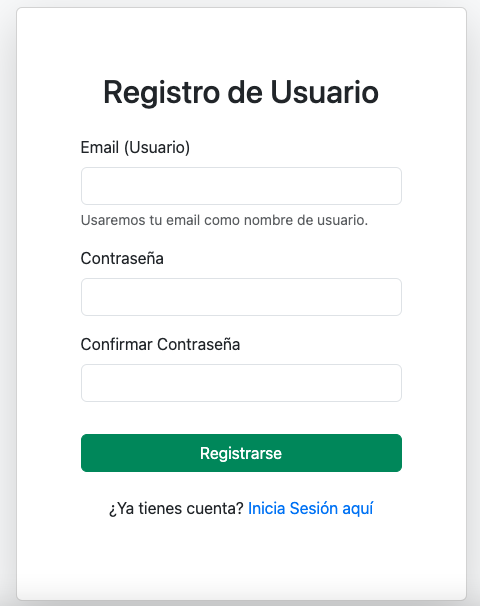
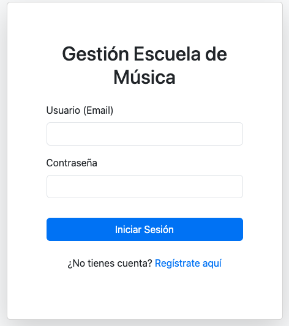
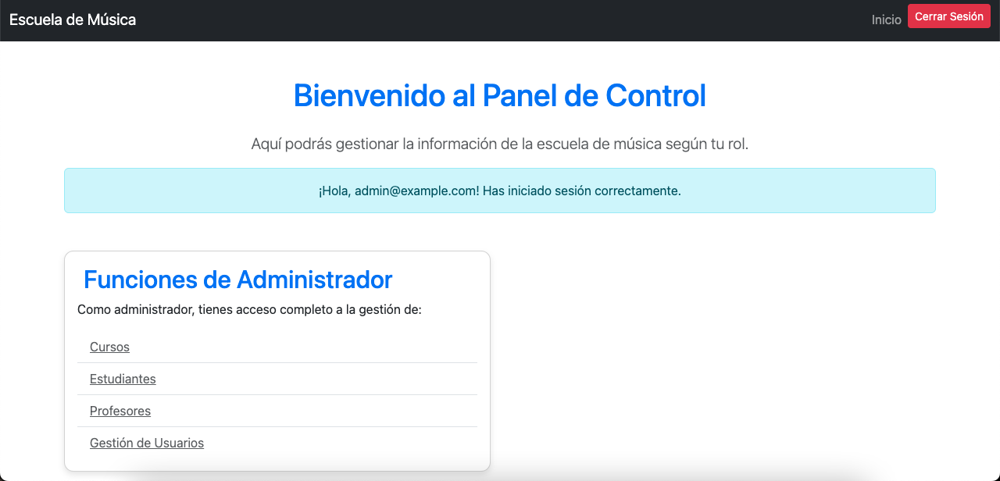
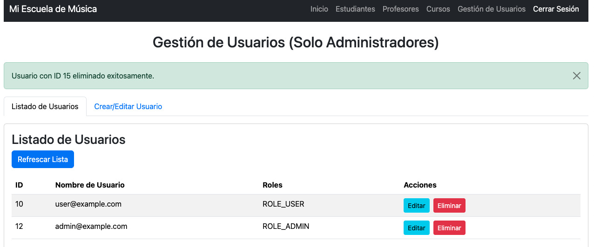
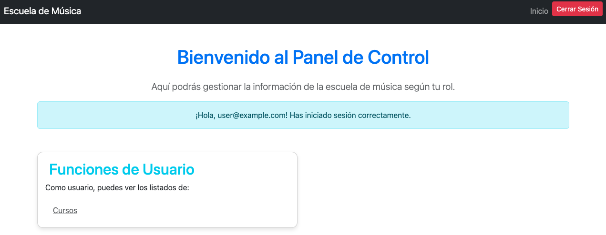

# Sistema de Gestión de Cursos - (ESCUELA DE MÚSICA)

Este proyecto es un sistema de gestión de cursos simple, desarrollado como un ejercicio práctico para aplicar conceptos de Spring Boot (Backend) y JavaScript/HTML/CSS (Frontend) con autenticación JWT y manejo de roles. Permite la administración de cursos, profesores, estudiantes y usuarios, con diferentes niveles de acceso.

## ✨ Tecnologías Utilizadas

### Backend (Spring Boot)

* **Java 17 (o superior):** Lenguaje de programación.
* **Spring Boot 3.x:** Framework principal para el desarrollo rápido de aplicaciones Java.
* **Spring Security:** Para la autenticación (JWT) y autorización basada en roles.
* **Spring Data JPA:** Para la interacción con la base de datos de manera simplificada.
* **PostgreSQL:** Base de datos relacional robusta utilizada para la persistencia de datos.
* **Lombok:** Para reducir el boilerplate code (constructores, getters, setters, etc.).
* **Maven:** Herramienta de gestión de dependencias y construcción del proyecto.

### Frontend (HTML, CSS, JavaScript)

* **HTML5:** Estructura de las páginas web.
* **CSS3 (Bootstrap 5.3):** Estilos y componentes responsivos para la interfaz de usuario.
* **JavaScript (ES6+):** Lógica del lado del cliente para interactuar con la API REST.
* **Fetch API:** Para realizar peticiones HTTP al backend.
* **JWT (JSON Web Tokens):** Manejo de tokens para la autenticación y autorización.

## ✨ Funcionalidades

### Roles de Usuario

El sistema soporta los siguientes roles:

* **ADMIN:** Acceso completo a todas las operaciones CRUD (Crear, Leer, Actualizar, Eliminar) para Usuarios, Cursos, Profesores y Estudiantes.
* **USER:** Acceso de solo lectura (vista) a la lista de Cursos.

### Módulos Implementados

* **Autenticación:**

    * Registro de nuevos usuarios (solo por administradores).
    * Login de usuarios existentes.
    * Protección de rutas/endpoints mediante JWT.
* **Gestión de Usuarios:**

    * CRUD completo para administradores (crear, listar, actualizar, eliminar usuarios).
    * Asignación de roles al crear/editar usuarios.
* **Gestión de Cursos:**

    * CRUD completo para administradores.
    * Visualización de cursos para usuarios.
    * Asignación de profesores a cursos.
* **Gestión de Profesores:**

    * CRUD completo para administradores.
* **Gestión de Estudiantes:**

    * CRUD completo para administradores.

## 🖼️ Galería de Pantallas



  








## ⚙️ Configuración y Ejecución

### Requisitos Previos

* Java Development Kit (JDK) 17 o superior.
* Maven 3.x.
* **Servidor PostgreSQL:** Con una base de datos creada (ej. `gestion_cursos`).
* Un editor de código o IDE (IntelliJ IDEA, VS Code, Eclipse).
* Navegador web moderno (Chrome, Firefox, Edge).

### Configuración de la Base de Datos

Antes de ejecutar el backend, asegúrate de configurar tu archivo `application.properties` (o `application.yml`) en `src/main/resources` con las credenciales de tu base de datos PostgreSQL:

```properties
spring.datasource.url=jdbc:postgresql://localhost:5432/gestion_cursos
spring.datasource.username=tu_usuario_postgres
spring.datasource.password=tu_password_postgres
spring.jpa.hibernate.ddl-auto=update
spring.jpa.show-sql=true
spring.jpa.properties.hibernate.dialect=org.hibernate.dialect.PostgreSQLDialect
```

### Pasos para Ejecutar el Backend

1. Clonar el Repositorio (si aplica) o descargar el proyecto.
2. Navegar a la carpeta del Backend (donde se encuentra el pom.xml).
3. Compilar y Ejecutar:

```bash
mvn clean install
mvn spring-boot:run
```

O ejecutar directamente desde tu IDE (ejecutando la clase principal \*Application.java). El backend se iniciará por defecto en [http://localhost:8080](http://localhost:8080).

#### Inclusión Especial

* **DataLoader:** Precarga datos iniciales (usuarios, cursos, profesores, etc.) para facilitar pruebas.
* **JWT Key Generator:** Generación automática de la clave JWT para firmar/verificar tokens.

### Pasos para Ejecutar el Frontend

1. Navegar a la carpeta del Frontend (`static`, `src/main/resources/static`, o carpeta aparte).
2. Abrir `login.html` o `index.html` en tu navegador.

**Nota:** Para evitar problemas con CORS, se recomienda usar Live Server en VS Code o un servidor simple como `http-server` desde npm.

## 🔑 Cuentas de Prueba Iniciales

Gracias al DataLoader, puedes usar las siguientes cuentas para comenzar:

**ADMIN:**

* Usuario: `admin@example.com`
* Contraseña: `adminpassword`

**USER:**

* Usuario: `user@example.com`
* Contraseña: `userpassword`

(Si tu DataLoader precarga otros datos, puedes mencionarlos aquí.)

## 💡 Qué Aprendí y Reforcé

### Backend:

* Spring Boot 3: Creación de APIs RESTful.
* Spring Security con JWT: Autenticación y autorización con tokens.
* Autorización basada en roles: Control de acceso detallado.
* JPA + PostgreSQL: Persistencia de datos y relaciones.
* Manejo de excepciones: Respuestas controladas y claras.

### Frontend:

* Interacción con APIs REST (Fetch API).
* Manipulación del DOM con JavaScript puro.
* Manejo de sesión con JWT en localStorage.
* Aceleración del desarrollo mediante asistencia de IA para vistas base.

## 🚧 Notas y Consideraciones

* **Seguridad:** Este proyecto no está listo para producción. Considerar HTTPS, validaciones más robustas, límites de tasa, etc.
* **Frontend y Backend separados:** Se ejecutan en distintos puertos, requiere configuración adecuada de CORS.
* **Validaciones en el cliente:** Mejorar la UX con validaciones más detalladas en el formulario.

## 🤝 Contribuciones

Este es un proyecto de ejercicio. Si tienes sugerencias o mejoras, ¡son bienvenidas!

✒️ **Desarrollado por [Juan Diego Merhcán]** - Aprendiendo Spring Boot 🚀