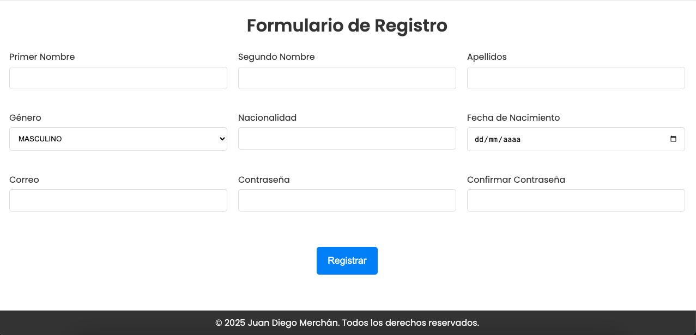
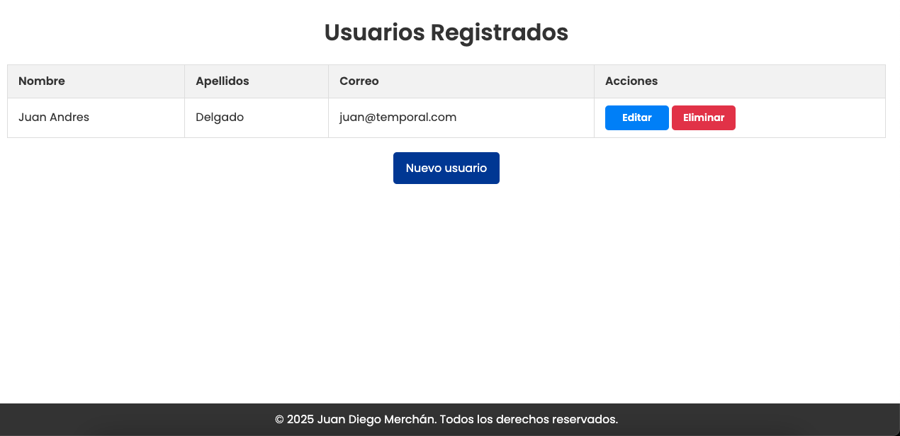
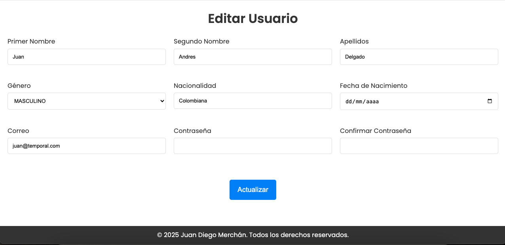
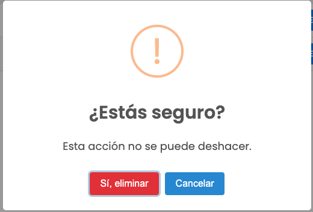

# Registro de Usuarios con Spring Boot y Thymeleaf

Este proyecto es una aplicación de gestión de usuarios desarrollada con Spring Boot y Thymeleaf. Utiliza H2 Database para el almacenamiento de datos y ofrece una interfaz moderna diseñada con CSS y JavaScript. La aplicación permite registrar nuevos usuarios mediante un formulario validado, visualizar una lista de usuarios registrados y gestionar su información con opciones para editar o eliminar registros. Además, incorpora SweetAlert2 para mostrar notificaciones interactivas y mejorar la experiencia del usuario.
## Características

- 📌 **Backend con Spring Boot**: Manejo de controladores y servicios para la gestión de usuarios.
- 🎨 **Frontend con Thymeleaf, CSS, JS**: Plantillas dinámicas y diseño con CSS personalizado.
- 🛠 **Persistencia en memoria con H2**: Base de datos en memoria para pruebas rápidas.
- 🔔 **Notificaciones con SweetAlert2**: Alertas visuales para acciones como registro, actualización y eliminación de usuarios.
- 📁 **Estructura organizada**: Código estructurado siguiendo buenas prácticas de MVC.

## Tecnologías Utilizadas

- **Java 21**
- **Spring Boot 3** (Spring MVC, Spring Data JPA)
- **Thymeleaf**
- **H2 Database**
- **CSS**
- **JavaScript**
- **SweetAlert2**

## Instalación y Ejecución

1. Clona este repositorio:
   ```sh
   git clone https://github.com/tu-usuario/tu-repositorio.git
   ```
2. Accede al directorio del proyecto:
   ```sh
   cd nombre-del-proyecto
   ```
3. Ejecuta la aplicación con Maven:
   ```sh
   mvn spring-boot:run
   ```
4. Accede a la aplicación en tu navegador:
   ```
   http://localhost:8080
   ```

## Funcionalidades

- Registrar un nuevo usuario con un formulario detallado.

  
- Listar usuarios registrados en una tabla.
  
- Editar la información de un usuario.
  
- Eliminar usuarios con confirmación visual sweetalert2
  


## Mejoras Futuras

- Implementación de seguridad con **Spring Security**.
- Integración con **una base de datos real** como MySQL o PostgreSQL.

## Información de Contacto:
- **Nombre:** Juan Diego Merchán
- **Correo Electrónico:** juandiegosdb@gmail.com
- **LinkedIn:** [https://www.linkedin.com/in/jdmj/]


Proyecto desarrollado como parte de la práctica en **Spring Boot y Thymeleaf**.

---
🚀 **¡Listo para ser desplegado y mejorado!**

